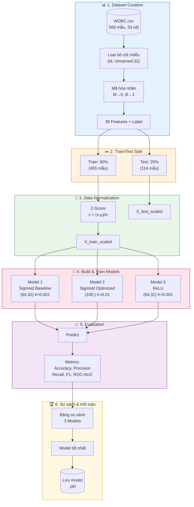
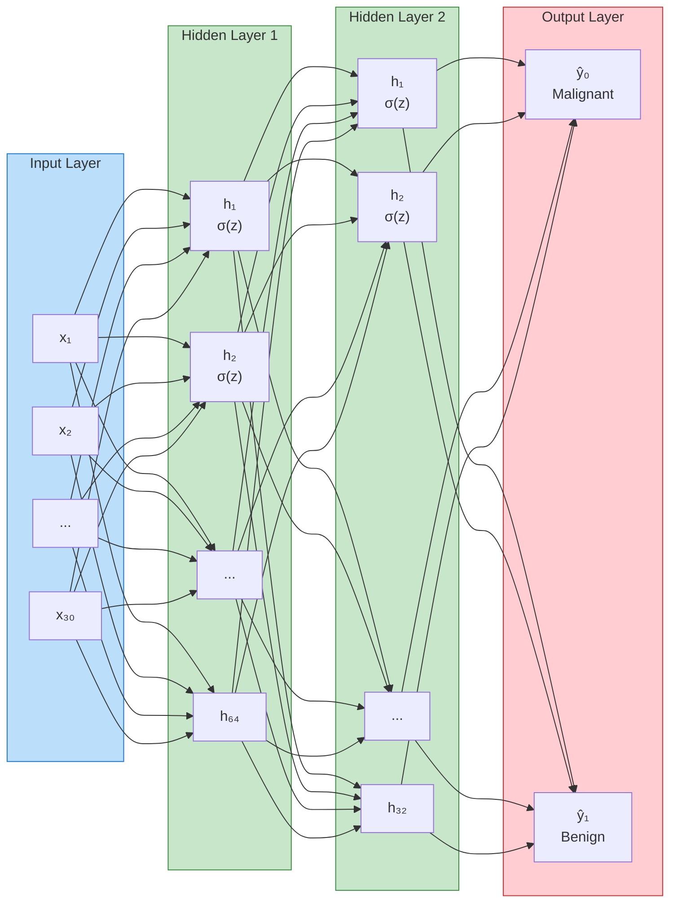

# Áp dụng Multilayer Perceptron (MLP) để phân loại ung thư trong tập dữ liệu WDBC

## Mô tả đề tài

Dự án này triển khai mạng nơ-ron **Multilayer Perceptron (MLP)** để phân loại khối u **lành tính (Benign)** và **ác tính (Malignant)** từ dữ liệu **Wisconsin Diagnostic Breast Cancer (WDBC)**.

**Điểm nhấn:** So sánh 3 cấu hình MLP khác nhau để tìm ra phương pháp tối ưu và giải thích vấn đề **Vanishing Gradient** với Sigmoid activation.

### Thông tin Dataset

- **Nguồn:** Wisconsin Diagnostic Breast Cancer Dataset
- **Số mẫu:** 569
- **Số đặc trưng:** 30 features (các đặc điểm được tính từ hình ảnh số hóa của khối u)
- **Số lớp:** 2 (Malignant - Ác tính, Benign - Lành tính)

### Mục tiêu

- So sánh 3 cấu hình MLP để tìm ra mô hình tối ưu
- Giải thích vấn đề Vanishing Gradient với Sigmoid activation
- Triển khai theo đúng Training Pipeline từ slide MLP (GV Hoang Duc Quy)
- Tạo các biểu đồ trực quan cho báo cáo

---

## Cấu trúc thư mục

```
MultilayerPerceptron_WDBC_7/
├── data/
│   └── data.csv                 # WDBC dataset
├── notebooks/
│   └── wdbc_mlp_classification.ipynb   # Notebook chính (pipeline MLP hoàn chỉnh)
├── src/                         # Module tái sử dụng
│   ├── __init__.py
│   ├── config.py                # Cấu hình và hyperparameters
│   ├── data_preprocessing.py    # Tiền xử lý dữ liệu
│   ├── mlp_scratch.py           # MLP triển khai từ đầu
│   └── train.py                 # Huấn luyện và đánh giá
├── models/                      # Model đã train (.pkl)
├── reports/                     # Biểu đồ xuất cho báo cáo (PNG)
├── requirements.txt             # Dependencies
├── README.md                    # File này
└── WDBC.csv                     # Dataset gốc
```

---

## Training Pipeline (theo Slide MLP)

1. **Dataset curation** - Chuẩn bị dữ liệu: load, drop cột nhiễu, mã hóa nhãn
2. **Data normalization** - Chuẩn hóa Z-Score (StandardScaler)
3. **Build model** - Xây dựng MLP với Sigmoid (hidden) + Softmax (output)
4. **Optimizer selection** - Chọn optimizer Adam/SGD
5. **Parameter Initialization** - Khởi tạo tham số (Xavier)
6. **Metrics/Loss selection** - Categorical Cross-Entropy

---

## Lưu đồ Pipeline



### Sơ đồ kiến trúc MLP



**Chú thích:**
- **σ(z)** = Sigmoid: `1/(1+e^(-z))` hoặc ReLU: `max(0,z)`
- **Output** = Softmax: `e^(zⱼ)/Σe^(zₖ)`

---

## So sánh 3 Cấu hình MLP

| Model | Hidden Layers | Activation | Learning Rate | Mục đích |
|-------|---------------|------------|---------------|----------|
| **Sigmoid Baseline** | (64, 32) | Sigmoid | 0.001 | Thể hiện vấn đề Vanishing Gradient |
| **Sigmoid Optimized** | (100,) | Sigmoid | 0.01 | Giảm vanishing gradient (1 layer, lr cao) |
| **ReLU** | (64, 32) | ReLU | 0.001 | So sánh với activation không có vanishing gradient |

### Vấn đề Vanishing Gradient

Sigmoid activation có đạo hàm tối đa = 0.25. Khi có nhiều layers, gradient bị nhân liên tiếp:
- 2 layers: 0.25 × 0.25 = 6.25%
- 3 layers: 0.25³ = 1.56%

→ Gradient quá nhỏ → Model không học được

### Công thức toán học

| Thành phần | Công thức | Implementation |
|------------|-----------|----------------|
| **Z-Score** | z = (x - μ) / σ | `StandardScaler()` |
| **Sigmoid** | g(z) = 1 / (1 + e^(-z)) | `activation='logistic'` |
| **ReLU** | g(z) = max(0, z) | `activation='relu'` |
| **Softmax** | g(zⱼ) = e^(zⱼ) / Σₖ e^(zₖ) | Softmax (tự động) |
| **Cross-Entropy** | L = -Σⱼ yⱼ log(ŷⱼ) | sklearn mặc định |

---

## Biểu đồ tạo ra

1. **Phân bố lớp** - Bar chart & Pie chart
2. **Ma trận tương quan** - Correlation Heatmap
3. **So sánh Learning Curves** - 3 models trên cùng 1 đồ thị
4. **So sánh Metrics** - Accuracy, Precision, Recall, F1 của 3 models
5. **Confusion Matrices** - Ma trận nhầm lẫn của 3 models
6. **ROC Curves** - So sánh AUC của 3 models
7. **Learning Curve chi tiết** - Model tốt nhất

---

## Cách chạy

### 1. Cài đặt dependencies

```bash
pip install -r requirements.txt
```

### 2. Chạy notebook

```bash
cd notebooks
jupyter notebook wdbc_mlp_classification.ipynb
```

### 3. Hoặc sử dụng modules Python

```python
from src.data_preprocessing import preprocess_pipeline
from src.train import create_mlp_sklearn, train_model, evaluate_model

# Tiền xử lý
data = preprocess_pipeline()

# Tạo và huấn luyện model
model = create_mlp_sklearn()
model = train_model(model, data['X_train_scaled'], data['y_train'])

# Đánh giá
results = evaluate_model(model, data['X_test_scaled'], data['y_test'])
```

---

## Kết quả dự kiến

| Model | Accuracy | ROC-AUC | Nhận xét |
|-------|----------|---------|----------|
| Sigmoid Baseline | ~60-90% | ~0.85 | Vanishing gradient, học yếu |
| Sigmoid Optimized | ~95-97% | ~0.99 | Cải thiện nhờ 1 layer + lr cao |
| ReLU | ~96-98% | ~0.99 | Tốt nhất, không vanishing gradient |

**Khuyến nghị:**
- Nếu phải dùng Sigmoid (theo lý thuyết): 1 hidden layer + learning rate 0.01
- Trong thực tế: Dùng ReLU để đạt hiệu suất tốt nhất

---

## Dependencies

- Python >= 3.8
- pandas >= 1.3.0
- numpy >= 1.21.0
- matplotlib >= 3.4.0
- seaborn >= 0.11.0
- scikit-learn >= 1.0.0
- jupyter >= 1.0.0

---

## Tài liệu tham khảo

- Slide MLP - GV Hoang Duc Quy (AI & Applications)
- UCI Machine Learning Repository - Breast Cancer Wisconsin (Diagnostic)
- Scikit-learn Documentation - MLPClassifier

---

## License

MIT License
