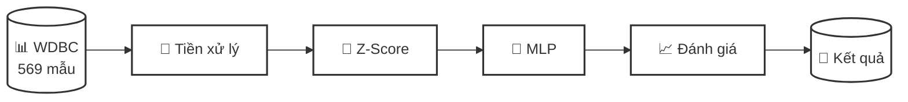
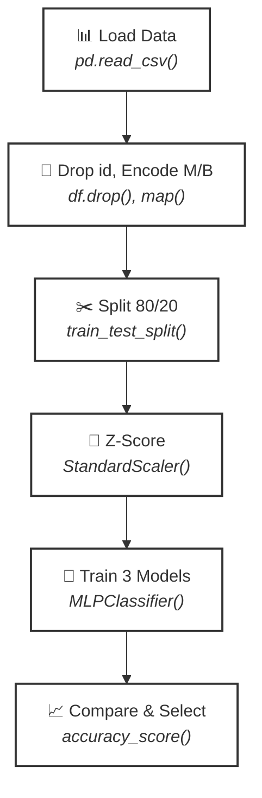
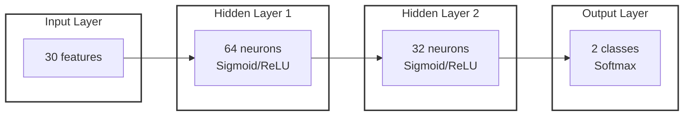
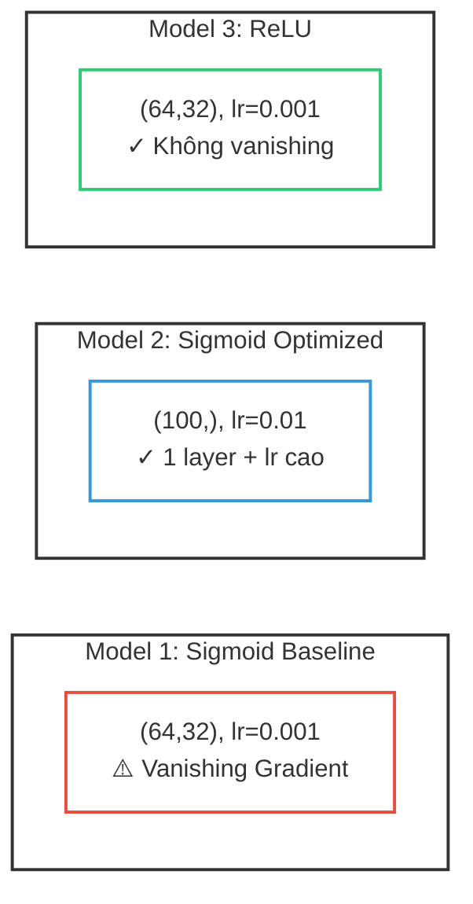

# Pipeline MLP WDBC - Slide PowerPoint

## Lưu đồ Pipeline (Đơn giản)



**Giải thích từng bước:**

| Bước | Mô tả | Công cụ/Phương pháp |
|------|-------|---------------------|
| 📊 WDBC | Dataset ung thư vú Wisconsin, 569 mẫu, 30 đặc trưng | `pd.read_csv()` |
| 🧹 Tiền xử lý | Loại bỏ cột `id`, mã hóa nhãn M→0, B→1 | `df.drop()`, `df.map()` |
| 📐 Z-Score | Chuẩn hóa: z = (x - mean) / std | `StandardScaler()` |
| 🧠 MLP | Huấn luyện mạng neural với Sigmoid/ReLU | `MLPClassifier()` |
| 📈 Đánh giá | Tính Accuracy, Precision, Recall, F1, ROC-AUC | `sklearn.metrics` |
| 🎯 Kết quả | Model tốt nhất đạt ~96-98% accuracy | Lưu `.pkl` |

---

## Lưu đồ Chi tiết (6 bước)



**Chi tiết từng bước:**

### 1. 📊 Load Data
- **Làm gì:** Đọc file CSV chứa dữ liệu WDBC
- **Dùng:** `pandas.read_csv('data.csv')`
- **Kết quả:** DataFrame 569 dòng × 33 cột

### 2. 🧹 Tiền xử lý
- **Làm gì:** 
  - Xóa cột `id` (không phải feature)
  - Xóa cột `Unnamed: 32` (cột rỗng)
  - Mã hóa: Malignant → 0, Benign → 1
- **Dùng:** `df.drop()`, `df['diagnosis'].map({'M': 0, 'B': 1})`
- **Kết quả:** 30 features + 1 label

### 3. ✂️ Train/Test Split
- **Làm gì:** Chia dữ liệu thành 80% train, 20% test
- **Dùng:** `train_test_split(X, y, test_size=0.2, stratify=y)`
- **Kết quả:** 455 mẫu train, 114 mẫu test

### 4. 📐 Z-Score Normalize
- **Làm gì:** Chuẩn hóa để tất cả features có mean=0, std=1
- **Công thức:** `z = (x - μ) / σ`
- **Dùng:** `StandardScaler().fit_transform()`
- **Lý do:** Giúp gradient descent hội tụ nhanh hơn

### 5. 🧠 Train 3 Models
- **Làm gì:** Huấn luyện 3 cấu hình MLP khác nhau
- **Dùng:** `MLPClassifier(hidden_layer_sizes, activation, ...)`
- **3 Models:**
  - Sigmoid Baseline: (64,32), lr=0.001
  - Sigmoid Optimized: (100,), lr=0.01
  - ReLU: (64,32), lr=0.001

### 6. 📈 Compare & Select
- **Làm gì:** So sánh metrics, chọn model tốt nhất
- **Dùng:** `accuracy_score()`, `confusion_matrix()`, `roc_auc_score()`
- **Kết quả:** ReLU đạt accuracy cao nhất (~98%)

---

## Kiến trúc MLP



**Giải thích kiến trúc:**

| Layer | Số neurons | Activation | Chức năng |
|-------|------------|------------|-----------|
| Input | 30 | - | Nhận 30 features từ dữ liệu |
| Hidden 1 | 64 | Sigmoid/ReLU | Học các pattern phức tạp |
| Hidden 2 | 32 | Sigmoid/ReLU | Tinh chỉnh features |
| Output | 2 | Softmax | Xác suất cho 2 class (M/B) |

---

## So sánh 3 Models



**Tại sao 3 cấu hình này?**

| Model | Mục đích thí nghiệm |
|-------|---------------------|
| Sigmoid Baseline | Thể hiện vấn đề vanishing gradient (2 layers + lr thấp) |
| Sigmoid Optimized | Giải pháp: giảm layers (1) + tăng lr (×10) |
| ReLU | Giải pháp tốt nhất: đổi activation function |

---

## Pipeline dạng Text (Copy vào slide)

```
WDBC Dataset (569 mẫu, 30 features)
        ↓ pd.read_csv()
   Tiền xử lý (Drop id, Encode M→0/B→1)
        ↓ df.drop(), map()
   Train/Test Split (80%/20%)
        ↓ train_test_split()
   Chuẩn hóa Z-Score
        ↓ StandardScaler()
   Huấn luyện 3 Models MLP
        ↓ MLPClassifier()
   So sánh & Chọn Model tốt nhất
        ↓ accuracy_score()
   Kết quả: Accuracy ~96-98%
```

---

## Công thức chính

| Tên | Công thức | Ý nghĩa |
|-----|-----------|---------|
| Z-Score | `z = (x - μ) / σ` | Chuẩn hóa về mean=0, std=1 |
| Sigmoid | `σ(z) = 1 / (1 + e^(-z))` | Activation, output [0,1] |
| ReLU | `f(z) = max(0, z)` | Activation, không vanishing |
| Softmax | `softmax(zⱼ) = e^zⱼ / Σe^zₖ` | Chuyển thành xác suất |
| Accuracy | `(TP+TN) / (TP+TN+FP+FN)` | Tỷ lệ dự đoán đúng |

---

## Kết quả tóm tắt

| Model | Accuracy | ROC-AUC | Nhận xét |
|-------|----------|---------|----------|
| Sigmoid Baseline | ~95% | ~0.98 | Vanishing gradient, học chậm |
| Sigmoid Optimized | ~97% | ~0.99 | Cải thiện nhờ 1 layer + lr cao |
| **ReLU** | **~98%** | **~0.99** | **Tốt nhất, không vanishing** |
